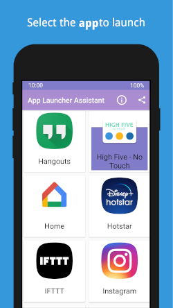
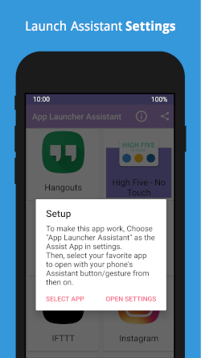

## ⬇️ Download
[][google-play-link]

## 🛠 Setup

- Select the app to be launched 
- Set App-Launcher-Assistant as the default Assistant app on your device.

..that's it. Launch the selected app with your device's Assistant button/gesture anytime.

## ⏯ Demo


## 📷 Screenshots





## 👷🏼 Build
- provide actual values in the app `build.gradle` file for the keystore 
```
            storeFile file($keystore_ala_storeFile)
            storePassword $keystore_ala_storePassword
            keyAlias $keystore_ala_keyAlias
            keyPassword $keystore_ala_keyPassword
```

## 👬 Contribution

- Report issues, Open pull request with improvements.
- If you feel compelled, I'd love if you spread the word!
- Reach out with any feedback 
- Buy me a beer [](https://www.paypal.me/vinaywadhwa) (app is free to use + no ads etc)

## 🏅 License

[](https://creativecommons.org/licenses/by/4.0/)


[google-play-link]: https://play.google.com/store/apps/details?id=com.vwap.app_launcher_assistant&referrer=utm_source%3DGitHub%26utm_campaign%3DREADME
[f-droid-link]: https://f-droid.org/app/com.vwap.app_launcher_assistant
